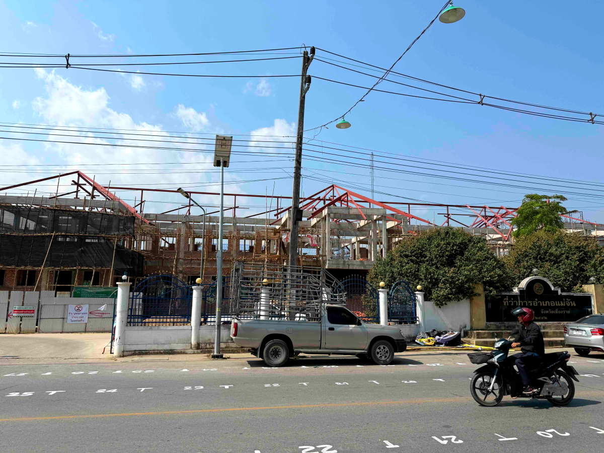
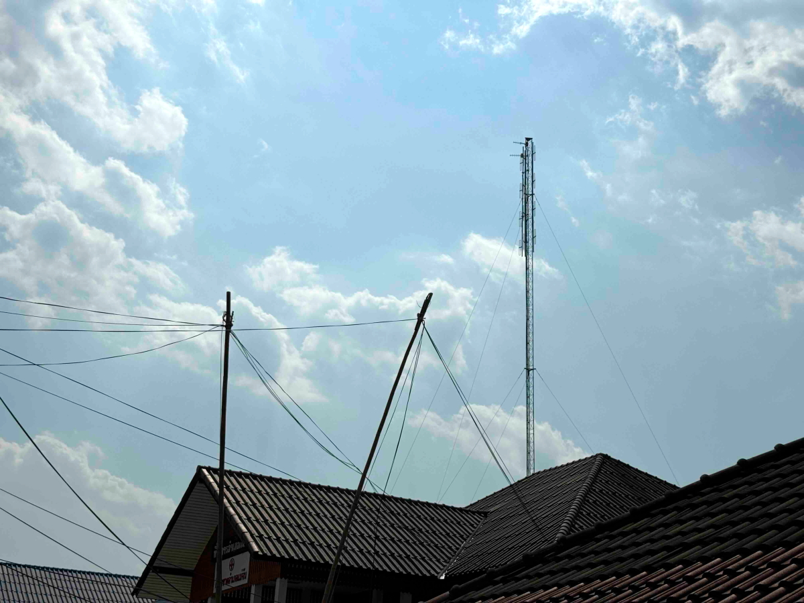
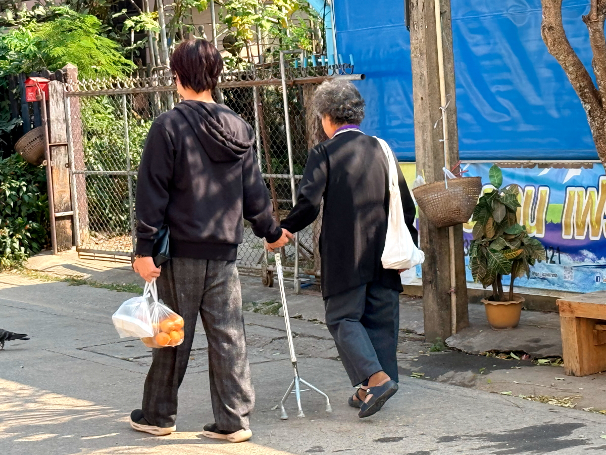
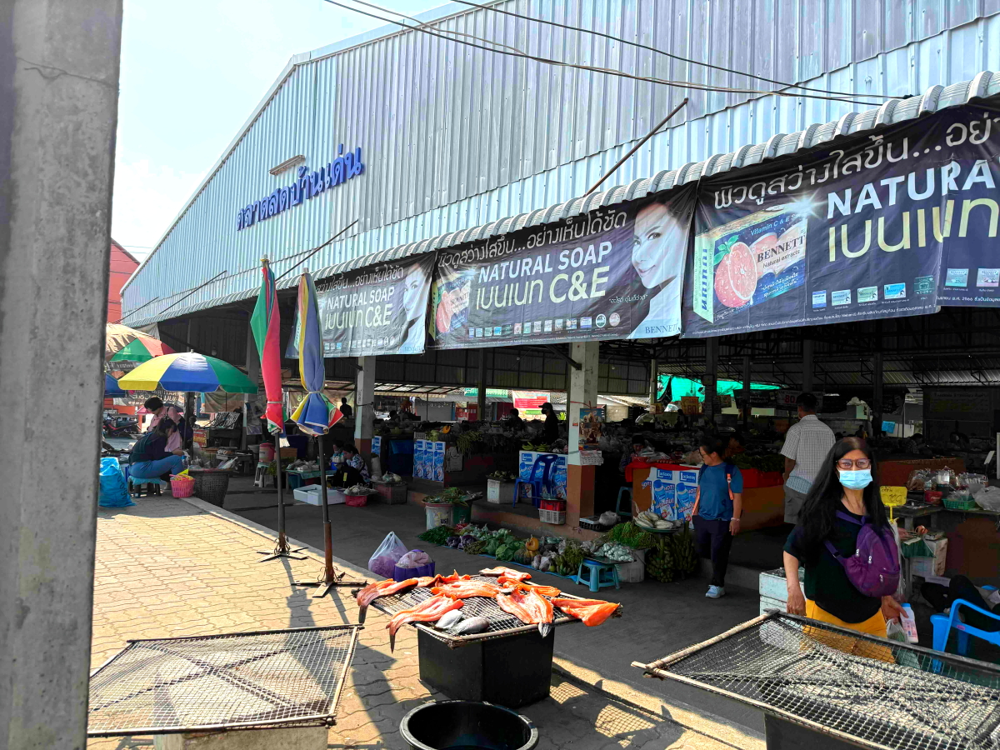

# 20250206_chiangrai

<html>
<head>

<meta charset="UTF-8">
<meta http-equiv="Content-Type" content="text/html; charset=UTF-8">
<meta http-equiv="X-UA-Compatible" content="IE=EmulateIE10" />
<meta http-equiv="X-UA-Compatible" content="IE=edge">

<!--ここから上はお決まりの定型文です-->

<!--ここからが表現の書式などを決めるcssという部分-->

<link href="https://cdnjs.cloudflare.com/ajax/libs/lightbox2/2.7.1/css/lightbox.css" rel="stylesheet">

</head>

<body>

モバイル端末をお使いの場合は、画面を横向きにすると
より見やすくご覧頂けます。

<!--ここ上は、ほぼそのまま使います！-->

<!--QRコードの挿入例-->

 アクセス用QRコード

<marquee direction="left" scrollamount="20" width="30%">(^_^)/~alis</marquee>

<!--流れ文字の挿入例-->
<h1><marquee behavior="left">!!! 2025/02/06、朝日の中で野鳥の鳴き声、メーチャンの街の同じ役場で昨日の続き!!!</marquee></h1>

                          

<!--ここから下が、本体部分-->

<h2>朝は野鳥の鳴き声が響き渡る朝日の中 朝7:53</h2>

<h2>野鳥の鳴き声が収録できました</h2>
<iframe width="560" height="315" src="https://www.youtube.com/embed/cUYzWy_s6oQ?si=9bhnT1G32J599YPE" title="YouTube video player" frameborder="0" allow="accelerometer; autoplay; clipboard-write; encrypted-media; gyroscope; picture-in-picture; web-share" referrerpolicy="strict-origin-when-cross-origin" allowfullscreen></iframe> 
    
<h2>お花の撮影方法をちょっと工夫、スマホの望遠レンズで接写モード</h2>

    
<h2>熱帯の陽射しでニワトリ一家も木陰に避難</h2>

    
<h2>この日もメーチャンの街を朝から訪問</h2>

    
<h2>タイの国旗が掲げられたビルに日本企業の名前</h2>

    
<h2>昨日斜めどりだったロータリーの仏壇を真後ろから撮影</h2>

    
<h2>警察署の建物も正面からパチリ</h2>

    
<h2>敷地の端には立派な仏壇がありました</h2>

    
<h2>昨日の役場に再手続きですが、ちょうど昼休みで皆食事中</h2>

    
<h2>役場の仏壇は今日もしっかり祀られてます</h2>

    
<h2>我々も近くの食堂でお昼にしました</h2>

    
<h2>食堂のテーブルに振られた番号もしっかり金色なのは仏教の影響か？</h2>

    
<h2>食事した食堂</h2>

    
<h2>向かい側は昨日屋根で溶接作業していた建物</h2>

    
<h2>食堂の皆様と記念撮影</h2>

    
<h2>大きい街の綺麗な食堂なので、食器は清潔そう</h2>

    
<h2>今日のお昼はチャーハンセットで60バーツ</h2>

    
<h2>食事の後半でスープが無料サービスでした</h2>

    
<h2>並びにあった何気ない駐車場の木に何かなってます</h2>

    
<h2>昔の人が噛んで歯を黒くする実です</h2>

    
<h2>入り口で見かけた白人さん、知り合いの旦那さんでオーストラリア人でした</h2>

    
<h2>スマホの音声翻訳機で会話が弾みます</h2>

    
<h2>役場内にコピー機が搬入されました、よく見るとCanon製</h2>

    
<h2>今日はまだ稼働してないので、いつもの半屋外コピーで書類複製</h2>

    
<h2>ふと屋根を見上げると、全ての公共施設に共通のアンテナ</h2>

    
<h2>お隣の警察署や、その向こうの建物にも同じアンテナが立ってました ちょっと専門的になりますが、アマチュア無線の430MHz八木アンテナのエレメントとほぼ同じサイズに見えます</h2>

    
<h2>街中ではハトに餌をあげる個人商店のお姉さま</h2>

    
<h2>猫も餌を狙ってました</h2>

    
<h2>同じ道をお孫さんに手を引かれて歩くお婆さん</h2>

    
<h2>帰り道の市場とコンビニにある仏壇も綺麗に祀られてます</h2>

    
<h2>仏壇の中も綺麗でした</h2>

    
<h2>市場の外ではお魚が天日干し、美味しそうな発色です</h2>

    
<h2>コンビニの駐車場に来ていたアイスをいただきました</h2>

    
<h2>午後の空にはお月様 月齢7.7</h2>

    
<h2>夕暮れは今日もオレンジ色が強いです</h2>

    
<h2>最後になりましたが、夜明け前の北斗七星と春の大曲線 前日見えなかったスピカまで入れて曲線完成 朝03:37</h2>

  
<h2><a href="https://www.kenko-tokina.co.jp/special/celestial/201504_sorawomiyou.html" target="_blank">春の大曲線、同じ説明リンクですが貼ります、この文字のクリックで飛びます</a></h2>

  
<h2>今日のBGMはタイのポップス、รวมเพลงใหม่ล่าสุด2025 เศร้าๆ ซึ้งๆ อินกับเพลงสุดๆ ฟังยาวๆ กันเลย ♫ (Official Audio) by KAN2019</h2>
<iframe width="560" height="315" src="https://www.youtube.com/embed/qLJ8ZZdNdvQ?si=vSZzHY67TrBuJbQA" title="YouTube video player" frameborder="0" allow="accelerometer; autoplay; clipboard-write; encrypted-media; gyroscope; picture-in-picture; web-share" referrerpolicy="strict-origin-when-cross-origin" allowfullscreen></iframe> 

   
<h2>以上、起床時間がどんどん遅くなって朝日が高く上がってました 昨日の町役場でまたまた雑用、帰り道に市場で買い出しでした ここまで観ていただきありがとうございました。</h2>

     
<h2>
<a href="https://torokoid.github.io/20241126_chiangrai/" target="_blank">Back to the menu page</a>
</h2>

   

         

  

      

<!--本体はここまで-->

<!--画面に空白地帯を作って、背景が見えるようにしています-->
                                              

<!-- フッタ -->
<footer>

Copyright 2025/02/07 alis @ChiangRai

</footer>

<!--HPにさまざまなJavaScriptを呼び込むための書式-->

